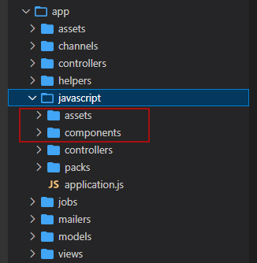
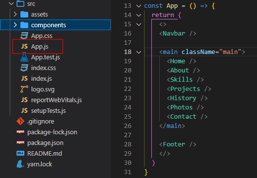
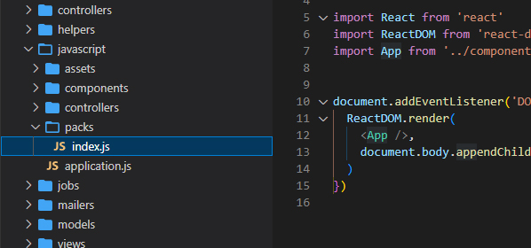
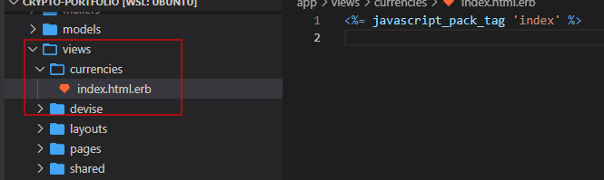

## Creating a React.js app with Ruby on Rails for Heroku deployment

### Table of Contents
* [Introduction](#introduction)
* [Prerequisites](#prerequisites)
  * [Ruby](#rubyinstall)
  * [Gems](#geminstall)
  * [Node.js](#nodeinstall)
  * [Yarn](#yarninstall)
  * [PostgreSQL](#postgresqlinstall)
  * [Heroku](#herokuinstall)
* [Setting up the project](#setup)
* [Integrating React.js into the project](#reactsetup)
* [React.js and Rails explained](#explained)
* [Local Testing](#local)
* [Deployment on Heroku](#heroku)
  * [Initial Deployment](#herokuinitial)
  * [Database Management](#herokudb)
  * [Troubleshooting](#herokutrouble)
* [Conclusion](#conclusion)

## Introduction:<a id="introduction"></a>

This guide will allow the user to:

- Create and configure a CRUD app with Ruby on Rails.
- Install and integrate React.js
- Explain the relationship between React.js and Rails.
- Configure and deploy the app on Heroku.

## Prerequisites:<a id="prerequisites"></a>
The following are required for operation. If these are already present in your configuration, you can skip these steps.

Follow the necessary guides for installation:

### Ruby:<a id="rubyinstall"></a>
- Ensure `rbenv` is installed by executing `brew install rbenv`.
- Install Ruby via `rbenv install 3.1.2`. This will take approx. **5 minutes** .
- Configure the system to use 3.1.2 by default by executing `rbenv global 3.1.2`.
- Restart your terminal.
- Confirm Ruby version with `ruby -v`.

### Gems:<a id="geminstall"></a>
- Execute the following to install key gems needed for this project:
  ```
  gem install colored faker http pry-byebug rake rails rest-client rspec rubocop-performance sqlite3
  ```
- Confirm Rails version with `rails -v`

### Node.js<a id="nodeinstall"></a>
- Install the Node.js version manager `nvm` by executing the following:
  ```
  curl -o- https://raw.githubusercontent.com/nvm-sh/nvm/v0.39.1/install.sh
  ```

- Restart your terminal.
- Confirm version with `nvm -v`.
- Install Node.js by executing `nvm install 16.15.1`.
- Confirm version with `node -v`.
- Execute `nvm cache clear` to clear current cache.

### Yarn<a id="yarninstall"></a>
- Install the Yarn package manager by executing `npm install --global yarn`.
- Confirm version with `yarn -v`.

### PostgreSQL<a id="postgresqlinstall"></a>
 - Install by executing the following commands:
   ```
   sudo apt install -y postgresql postgresql-contrib libpq-dev build-essential
   ```

   ```
   sudo /etc/init.d/postgresql start
   ```

   ```
   sudo -u postgres psql --command "CREATE ROLE \"`whoami`\" LOGIN createdb superuser;"
   ```
- Configure PostgreSQL to autostart on opening a terminal:
  ```
  sudo echo "`whoami` ALL=NOPASSWD:/etc/init.d/postgresql start" | sudo tee /etc/sudoers.d/postgresql
  ```
  ```
  sudo chmod 440 /etc/sudoers.d/postgresql
  ```
  ```
  echo "sudo /etc/init.d/postgresql start" >> ~/.zshrc
  ```

- Restart your terminal
- Confirm version with `psql --version`
- The message `Starting PostgreSQL 14 database server` will confirm successful installation.

### Heroku<a id="herokuinstall"></a>
- Install by executing `curl https://cli-assets.heroku.com/install.sh | sh`
- Confirm version with `heroku --version`

## Setting up the project:<a id="setup"></a>
The following will instruct you on how to create the initial setup for your Rails app:

- Create a new rails app by executing `rails new [APP-NAME] -d postgresql -j webpack`
- Navigate to the folder via `cd [APP-NAME]`
- Open the project in your preferred code editor (ex. VS Code via `code .`)
- Run initial `gem` install by executing `bundle install`

## Integrating React.js into the project<a id="reactsetup"></a>

The following will provide a breakdown of integrating React.js into your Rails app.
- Add `gem "webpacker"` to your `Gemfile`
- Install webpacker by executing `rails webpacker:install`
- Install react.js into your project by executing `rails webpacker:install:react`

## React.js and Rails explained<a id="explained"></a>

The following will explain how react.js is integrated into your project, and how to utilise it together with Rails.

The react.js files and functionality are located within the `app/javascript` folder as shown here:



This will contain the familiar folder structure of your `assets` and `components` within the `src` folder of a regular React.js app.

However, with a regular app, we expect to see the following files:



In the React.js app above, the App.js renders the components. With our Rails app, the file structure is a little different.

Here, we have a `packs` folder, in which we can find our `index.js`. This is the file that will render the contents of our `components`.



In order to display this within our rails app, we will be using this line:

`<%= javascript_pack_tag 'index' %>`

Where `index` refers to `index.js`

Likewise, if we had another `.js` file, for example `home.js`, we would be using the line:

`<%= javascript_pack_tag 'home' %>`

This will allow us to display different `.js` files within our rails app.

This line will then be placed in the appropriate `.html.erb` file with our `app/views` folder. In this case, it has been used in the `app/views/currencies/index.html.erb` file.



Now you can build your react.js objects in the components folder, and import them into your rails app!

## Local testing<a id="local"></a>
In order to run the project locally, execute the following:
  - Local server: `rails s` to run on `localhost:3000`
  - Yarn build: `yarn build --watch`

To setup your database for testing, execute the following:
- `rails db:create`
- `rails db:migrate`
- `rails db:seed`

_* Note: if you have an existing DB, you will need to run `rails db:reset`_

## Deployment on Heroku<a id="heroku"></a>

### Initial deployment<a id="herokuinitial"></a>
- Log in to Heroku by executing `heroku login` and following the login instructions.
- Create the name of your app by executing `heroku create [APP_NAME] --region eu`

  _Note: `--region eu` or `region us` can be selected based on your location, to reduce latency._
- Run `git push heroku master` in order to push your latest build to Heroku

Your app should now be live. You can check the URL (ex. `APP_NAME.herokuapp.com`) to confirm.

### Database management<a id="herokudb"></a>
- In order to generate your database on Heroku, the following commands need to be run:
  - `heroku run rails db:migrate`
  - `heroku run rails db:seed`

*Warning: Do not run `heroku run rails db:create`, it is not necessary in this instance.*

### Troubleshooting<a id="herokutrouble"></a>

- In order to pinpoint issues with Heroku deployment, run `heroku logs --tail`
- This will output the logs of the deployment, indicating any issues experienced.

- If you encounter issues with your current database, it can be reset as follows:
  - `heroku restart`
  - `heroku pg:reset DATABASE`

- Followed by:
  - `heroku run rails db:migrate`
  - `heroku run rails db:seed`


## Conclusion<a id="conclusion"></a>

With the above steps followed, you are now ready to code your own Ruby on Rails and React.js, and deploy it to Heroku!
