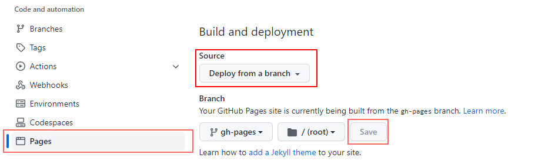

## Creating a React.js app for deployment on GH Pages.

### Table of Contents
* [Introduction](#introduction)
* [Prerequisites](#prerequisites)
  * [Node.js](#nodeinstall)
* [Setting up the project](#setup)
* [Local Testing](#heroku)
* [Preparing your react app for GH Pages](#prepare)
  * [Creating a Github repository and pushing.](#repocreate)
  * [File configuration](#config)
  * [Configuring the deployment on GH pages](#ghconfig)
* [Conclusion](#conclusion)

## Introduction:<a id="introduction"></a>

This guide has been written to explain how to build a react app and deploy it on Github pages.

## Prerequisites:<a id="prerequisites"></a>
The following are required for operation. If these are already present in your configuration, you can skip these steps.

Follow the necessary guides for installation:

### Node.js and NPM<a id="nodeinstall"></a>
- Install the Node.js version manager `nvm` by executing the following:
  ```
  curl -o- https://raw.githubusercontent.com/nvm-sh/nvm/v0.39.1/install.sh
  ```

- Restart your terminal.
- Confirm version with `nvm -v`.
- Install Node.js by executing `nvm install 16.15.1`.
- Confirm version with `node -v`.
- Confirm installation of NPM with `npm -v`.
- Execute `nvm cache clear` to clear current cache.

## Setting up the project:<a id="setup"></a>
The following will instruct you on how to create the initial setup for your React.js app:

- Create a new React.js app by executing `npx create-react-app [APP-NAME]`
- Navigate to the folder via `cd [APP-NAME]`
- Open the project in your preferred code editor (ex. VS Code via `code .`)

## Local testing<a id="local"></a>
In order to run the project locally, execute the following:
  - Local server: `npm start` to run on `localhost:3000`

## Preparing your React.js app for GH Pages<a id="prepare"></a>
The following will explain how to prepare your project for deployment on GH pages.

### Creating a Github repository and pushing.<a id="repocreate"></a>
- Create your Github repository for this project by executing the following lines:
  ```
  git init
  ```
  ```
  gh create repo --public --source=.
  ```
- This will create a repository with the same name as your project, that can be found via `github.com/{username}/{app-name}

- Push the project to Github by running the following lines:
  `git add .`
  `git commit -m "your commit message"`
  `git push origin master`

### File configuration<a id="config"></a>
- Install the `gh-pages` npm package by executing the following:
  ```
  npm install gh-pages --save-dev`
  ```
- Open the `package.json` file in your project root directory.
- Add a  `homepage` line in the file as follows:
  ```
  "name": "[APP-NAME]",
  "version": "0.1.0",
  "homepage": "https://{username}.github.io/{repository-name}",
  "private": true,
  ```
  Where {username} is your Github username, and {repository-name} is the name of the corresponding repository of this project.

  _* Note: the `homepage` line will need to be replaced with the URL that directs to it, so take note if you plan to add a custom domain name at a later date._

- Scroll down to the `Scripts` object in `package.json` and add the following:
  ```
  "scripts": {
    "predeploy": "npm run build",
    "deploy": "gh-pages -d build",
  ```

- Finally, run `npm run deploy` to push the project to Github pages.

### Configuring the deployment on GH pages<a id="ghconfig"></a>
The following will explain how to configure your newly deployed app on Github pages.
- Navigate to the settings page of your project repository, found at
`github.com/{username}/{repository name}/settings`

- Click on the `pages` link on the left, and you should see this screen:



- From here, set `Source` to `Deploy from a branch`
- Set `Branch` to `gh-pages`
- Set `Folder` to `/ (root)`
- Click `Save`

From here, your page will be deployed. This may take a couple of minutes.

## Conclusion<a id="conclusion"></a>

With the above steps followed, you can now continue to build your React.js app, and deploy it onto GH pages!

From here, you may be interested in setting up a custom domain for your page, that can also be configured on the `pages` page on the Github repository settings page.
